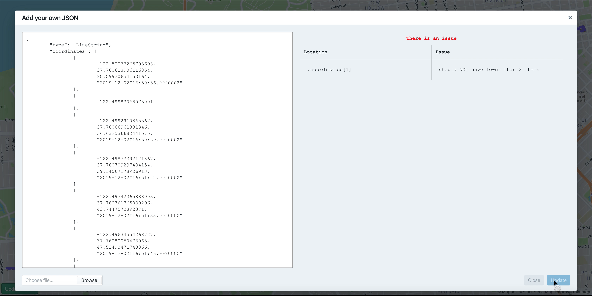

<div style="display: flex; align-items: center">
  
  <h1 align="left" style="font-family: monospace;"> | Atlas </h1> 
</div>
<br/>

  [](http://makeapullrequest.com)

Atlas is a ReactJS sample application to visualise a Hypertrack `trip_summary` or `LineString` geoJSON. Use this web app to debug your device's trips, investigate location & activity events in your trip.

<!-- > 💬 [Check out the blog post about Atlas here](__BLOG_POST_LINK_HERE__) -->

<p align="center">
  
</p>

## Overview

- [Hypertrack Altas](#ht-atlas)
- [Overview](#overview)
- [Features](#features)
- [Local Installation and setup](#installation-and-setup)
- [Usage](#usage)
- [Related](#related)
- [Credits](#credits)
- [License](#license)

## Features

Supported features of Hypertrack Atlas:

<table>
  <tr>
    <td align="center"><b>Activity Overview</b><br /></td>
    <td><ul>    
      <li>Start time of the activity (if available)</li>
      <li>End time of the activity (if available)</li>
      <li>Recorded duration of the activity (if available)</li>
      <li>Activity type: (classified into one of: Stop, Walk, Cycle, Drive, Unknown)</li>
      <li>Available only for <code>trip_summary</code></li>
    </ul></td>
  </tr>
  <tr>
    <td align="center"><b>Location Overview</b><br /></td>
    <td><ul>
      <li>Coordinates of the Location event</li>
      <li>Altitude of Location event (if available)</li>
      <li>Recorded timestamp of Location event (if available)</li>
      <li>Available for <code>trip_summary</code> & <code>LineString</code> geoJSONs</li>
    </ul></td>
  </tr>
  <tr>
    <td align="center"><b>Validation Overview</b><br /></td>
    <td><ul>
      <li>Erroneous input not be plotted, until corrections are performed</li>
      <li>Errors and thier locations are listed in the same popup</li>
      <li>Validation is available for <code>trip_summary</code> & <code>LineString</code> geoJSONs</li>
    </ul></td>
  </tr>
</table>

Features that can be enabled using `URLSearchParams`:

<table>
  <tr>
    <th>Search parameter key</th>
    <th>Required</th>
    <th>Default value</th>
    <th>Possible values & thier validity</th>
  </tr>
  <tr>
    <td align="center"><code>accessToken</code></td>
    <td align="center">✅</td>
    <td align="center">-</td>
    <td>
      Mapbox access token: <code>pk.__your_token_here__</code>. Pick up your token from mapbox, click <a href="https://docs.mapbox.com/accounts/overview/tokens/#mapbox-account-dashboard">here</a> for instructions.
    </td>
  </tr>
  <tr>
    <td align="center"><code>gist</code></td>
    <td align="center">❌</td>
    <td align="center">-</td>
    <td>Valid, public or private, <a href="https://help.github.com/en/github/writing-on-github/creating-gists#creating-a-gist">github gist</a> url</td>
  </tr>
  <tr>
    <td align="center"><code>shed_animation</code></td>
    <td align="center">❌</td>
    <td align="center"><code>false</code></td>
    <td>Set this key to <code>true</code>, to shed animations between map transitions</td>
  </tr>
  <tr>
    <td align="center"><code>hash</code></td>
    <td align="center">❌</td>
    <td align="center"><code>true</code></td>
    <td>Set this key to <code>false</code>, to remove the trailing hash fragment in the URL</td>
  </tr>
</table>

> `accessToken` once set, will be cached in the browser.

## Local Installation and setup

After cloning or forking this repository, you should install all dependencies on your machine:

```shell
# with npm
npm install

# or with Yarn
yarn
```

With the dependencies and configuration in place, you can start the server in development mode:

```shell
# with npm
npm start

# or with Yarn
yarn start
```

## Usage

You'd be using Atlas in one of 2 ways:

1. Start afresh with no data, One would acquire a `trip_summary` or `LineString` geoJSON; either paste the JSON as text in the text field, or upload one of the JSON type through the file input field. Once validated, `Update` button, would close the modal, and plot the location data on to the map
2. Atlas is loaded with a gist URL. In such scenario, Atlas would fetch the json from the gist (both public gists, and private gists are supported) and update the text field. Once validated, `Update` button, would close the modal, and plot the location data on to the map. <br/> The gist url can be supplied as a [URL search parameter](https://developer.mozilla.org/en-US/docs/Web/API/URLSearchParams) `gist`. <br/> Eg: `https://hypertrack.github.io/atlas/?gist=https://gist.github.com/SahRckr/c6ee0dd9b7bd605f8ca9d9b43561387d`

The validation of input will prohibit the input overlay to close and list out known problems in the input.

## Related

- [`trip_summary`](https://docs.hypertrack.com/#guides-apis-usage-trips-review-trip-summaries)
- [`LineString`](https://tools.ietf.org/html/rfc7946#section-3.1.4)

## Credits

This project uses the following open-source packages:

- [ajv](https://github.com/epoberezkin/ajv): The fastest JSON Schema Validator.
- [@blueprintjs/core](https://github.com/palantir/blueprint): A React-based UI toolkit for the web
- [mapbox-gl](https://github.com/mapbox/mapbox-gl-js): Interactive, thoroughly customizable maps in the browser, powered by vector tiles and WebGL

## License

This project is licensed under the MIT License - see the [LICENSE](LICENSE) file for details
